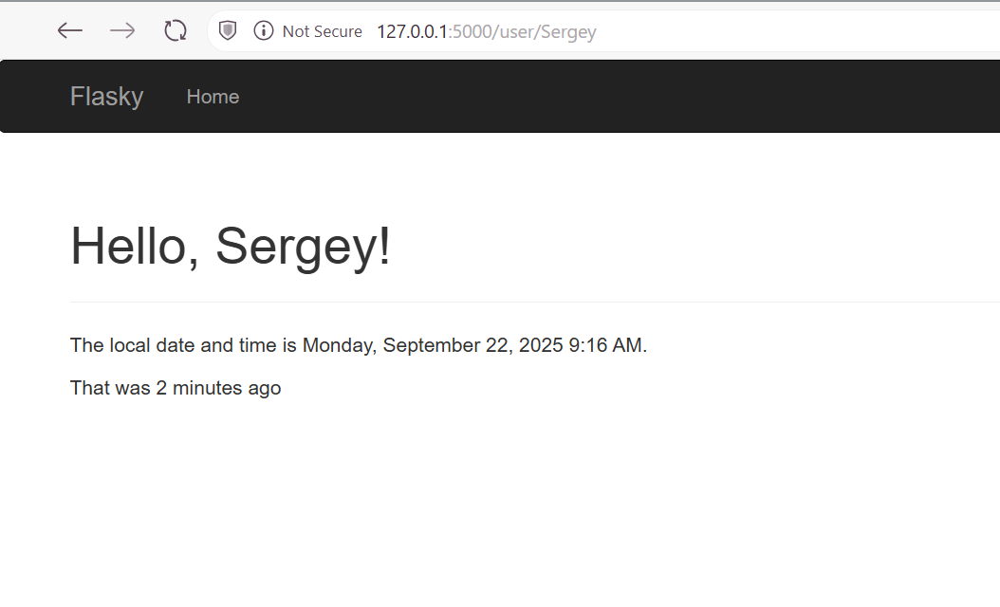
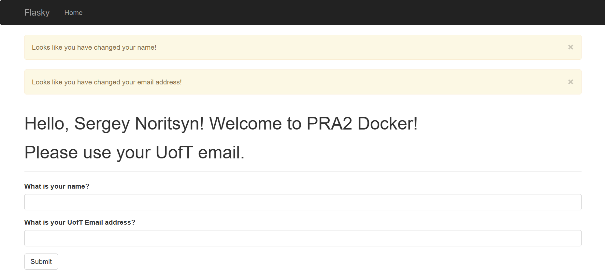

### Sergey Noritsyn's PRA 2 - Backend Development

Practicing the use of Flask & Docker for backend software development.

Instructions for use - through CMD/Powershell:
<pre> ```bash git clone https://github.com/SergeyNoritsyn/E444-F2025-PRA2.git
cd E444-F2025-PRA2
docker build -t hello-image .
docker run -it --rm -p 5000:5000 hello-image
``` </pre>

Screenshot of Dynamic 'User' Page


Screenshot of Flask Forms usage & email field validation


This repository is a clone of https://github.com/miguelgrinberg/flasky.